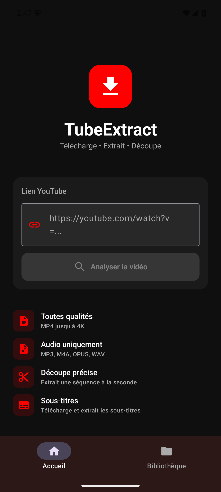
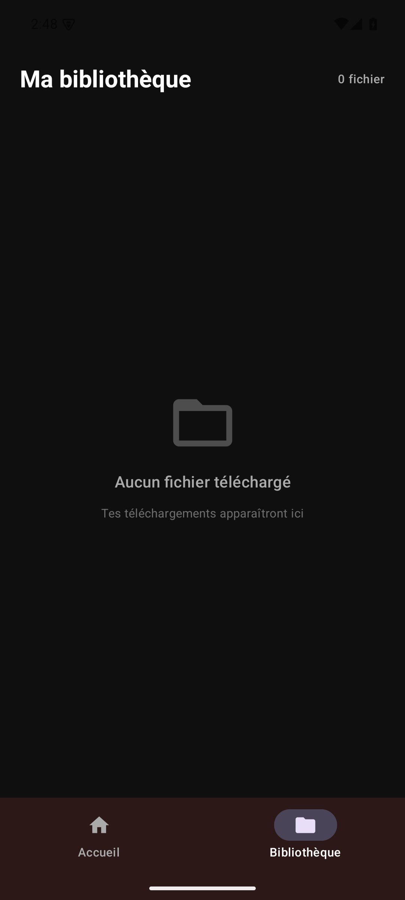

# TubeExtract

Prototype Android pour récupérer une vidéo depuis une URL, choisir une sortie vidéo ou audio, des sous-titres et éventuellement un segment temporel. Ce dépôt s'appelle historiquement `App-android` ; il contient TubeExtract, un projet distinct de VérifScoot.

## Ce que contient le projet

L'interface Kotlin / Jetpack Compose comporte accueil, choix du téléchargement, progression et bibliothèque. Elle accepte une URL saisie ou partagée via Android. `DownloadViewModel` interroge le wrapper yt-dlp Android, prépare les options audio/vidéo et sous-titres, télécharge puis utilise FFmpeg pour découper un segment. Les fichiers sont placés dans le répertoire externe propre à l'application, sous `Downloads/TubeExtract`.

Stack : Kotlin 1.9.24, Compose Material 3, coroutines / StateFlow, Coil, Android Gradle Plugin 8.3.2, Gradle 8.7, cible JVM 17. Android minimum 8.0 (API 26), compilation et cible API 34.

## Installation et téléchargement

Cloner ou télécharger les sources depuis GitHub. Installer JDK 17 et Android SDK API 34 avec les outils de compilation 34.0.0, puis définir `ANDROID_HOME` ou `sdk.dir` dans un `local.properties` non versionné.

```sh
sh ./gradlew assembleDebug test lint --no-daemon -Pandroid.builder.sdkDownload=false
```

Le build debug a réussi pendant cette préparation, avec deux tests JVM synthétiques réussis. L'APK se trouve dans `app/build/outputs/apk/debug/app-debug.apk`. Son installation sur un appareil de test peut se faire avec `adb install -r` suivi de ce chemin. La signature debug, l'installation et l'ouverture sur un émulateur Android 15 ARM64 vide ont été vérifiées. Le passage à la bibliothèque affiche bien zéro fichier. Le téléchargement, les formats, les sous-titres et le découpage réels restent à vérifier ; ce n'est pas une release fonctionnellement complète.

Le workflow GitHub construit l'APK debug et exécute les tests JVM avec `assembleDebug testDebugUnitTest`. [L'exécution du 4 octobre 2026](https://github.com/cpointis96-hue/App-android/actions/runs/37191448567) a réussi, y compris le build, les tests JVM et le dépôt de l'artefact `TubeExtract-debug`. Cet artefact est conservé 30 jours et son téléchargement nécessite un accès à GitHub. Consulter le résultat Actions avant de télécharger ; ce succès CI ne valide pas le téléchargement ni le traitement de médias réels sur Android.

## Limites observées dans le code

- Les dépendances yt-dlp / FFmpeg sont épinglées en `0.17.4` sous le groupe Maven Central `io.github.junkfood02.youtubedl-android`. Les anciennes coordonnées `com.github.yausername...:0.17.+` empêchaient le build. Le [README du fournisseur](https://github.com/yausername/youtubedl-android#installation) confirme le groupe ; les POM [library](https://repo.maven.apache.org/maven2/io/github/junkfood02/youtubedl-android/library/0.17.4/library-0.17.4.pom) et [ffmpeg](https://repo.maven.apache.org/maven2/io/github/junkfood02/youtubedl-android/ffmpeg/0.17.4/ffmpeg-0.17.4.pom) confirment cette version.
- L'initialisation yt-dlp et FFmpeg est désormais attendue avant les tâches dans le ViewModel. Le JSON brut sert à lire les sous-titres absents du modèle VideoInfo 0.17.4. Le découpage lance le binaire natif FFmpeg avec ses chemins de bibliothèques et contrôle le retour ainsi que la présence d'une sortie non vide ; les tests synthétiques valident ce contrat, pas le binaire Android. Le parcours réseau et le découpage réel restent à vérifier sur appareil.
- La liste de bibliothèque reste en mémoire et n'est pas reconstruite depuis les fichiers après redémarrage. La suppression retire un fichier et son entrée ; aucune lecture ou export n'est proposé dans cet écran.
- Un `DownloadService` existe, mais aucun appel pour le démarrer n'a été trouvé. Le téléchargement s'exécute dans le ViewModel ; la continuité en arrière-plan n'est pas établie.
- L'option nommée `burnSubtitles` utilise `--embed-subs`, ce qui demande l'intégration des sous-titres plutôt qu'une incrustation visuelle garantie. Le découpage copie les flux et sa précision n'est pas validée.
- Une copie peut remplacer un fichier portant le même nom. Aucune persistance d'historique, politique de collision ou récupération après interruption n'est validée.

Utiliser uniquement des médias auxquels vous avez accès et dont le téléchargement est autorisé. Aucun média ni historique personnel n'a été téléchargé pour cette préparation. Voir [VERIFICATION.md](VERIFICATION.md) pour les résultats et limites exacts. Aucun téléphone personnel n'a été utilisé.

## Captures réelles

Émulateur de test vide Android 15, APK debug compilé ici ; interface originale conservée. Les fonctions annoncées dans l'accueil ne sont pas toutes validées par ces captures.





## Notices des fournisseurs

Les deux POM 0.17.4 ci-dessus déclarent GPL-3.0 pour les artefacts youtubedl-android. FFmpeg décrit sa licence de base LGPL 2.1 ou ultérieure et les composants optionnels sous GPL dans sa [notice officielle](https://ffmpeg.org/legal.html). Ces mentions concernent les fournisseurs ; elles ne définissent pas une licence pour ce projet. La configuration exacte des binaires FFmpeg embarqués n'a pas été auditée ici.

## Dépôt et téléchargement

[Voir le dépôt](https://github.com/cpointis96-hue/App-android) · [Télécharger les sources ZIP](https://github.com/cpointis96-hue/App-android/archive/HEAD.zip). Le ZIP contient les sources ; l’APK debug se construit selon les instructions ci-dessus.
